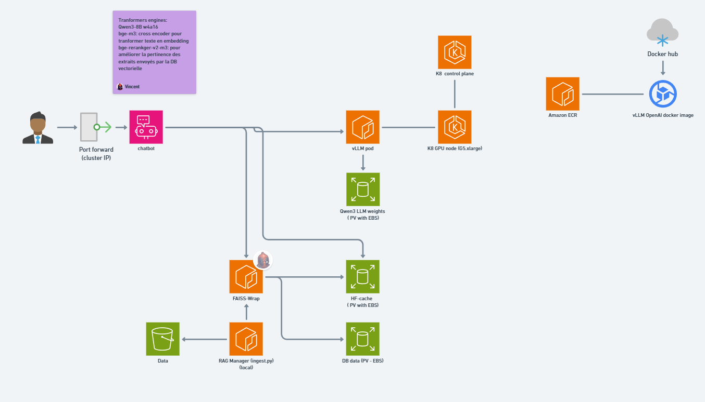

# LLASTAKS – LLM App Stack on Kubernetes as a Service

LLASTAKS is an end-to-end project to deploy, operate, and use a modern LLM application on AWS, leveraging Kubernetes (EKS), vLLM for inference, and application components (chatbot, RAG, fine-tuning, monitoring).

This README summarizes the project goals, the overall architecture, and explains how to use it quickly both locally and in the cluster.



## Objectives
- Validate understanding of a complete LLM deployment on the cloud.
- Build an automated, cost-effective, and reusable stack.
- Develop an application (chatbot) with RAG and future capabilities (function calling, code execution, LoRA fine-tuning, monitoring).

Detailed reference: `Project.md`.


## Architecture (overview)
- Kubernetes EKS on AWS, with a GPU node (g5.xlarge) and EBS storage for model weights.
- vLLM deployed in the cluster, exposing an OpenAI-compatible API (internal DNS: `vllm.llasta.cluster.local:8000`).
- Chatbot FastAPI + HTML/JS frontend orchestrating requests to vLLM (local first, then K8s).
- RAG component (ingestion + FAISS wrapper + chatbot-RAG) for contextual augmentation.
- Roadmap: monitoring (Prometheus/Grafana or CloudWatch), LoRA fine-tuning, function calling, code execution.


## Prerequisites
- AWS account with sufficient GPU quotas (G instances) and ECR/EBS enabled.
- Local tools: `awscli`, `kubectl`, `helm` (optional), `terraform`, `docker`, `python3` and `pip`.
- Access to the EKS cluster (up-to-date kubeconfig). See `000-K8 deployment/`.


## Repository structure
- `000-K8 deployment/` – EKS Terraform (multi-AZ, GPU node, etc.).
- `001-Copy weights to ebs/` – Manifests to prepare the weights volumes.
- `002-vLLM deployment/` – Manifests to deploy vLLM in the cluster.
- `003-chatbot/` – FastAPI backend and minimal frontend for a generic chatbot.
- `004-RAG/` – RAG components (ingestion, faiss-wrap, chatbot-RAG) and sample datasets.
- `Project.md` – Detailed description and project checklist.


## Quick deployment (cluster + vLLM)
The easiest way to bootstrap the infrastructure and vLLM is to use the repository root script `Deploy.sh`.

1) Run Deploy.sh from the repository root
- On Windows, use WSL or Git Bash. The script automatically `cd`s to its directory before running (so it’s robust when launched from anywhere).
- It will orchestrate Terraform (EKS), Kubernetes manifests, and prepare the environment for vLLM.

Example (WSL/Git Bash):
```bash
chmod +x ./Deploy.sh
./Deploy.sh
```

2) Verify access to the cluster
- Ensure your kubeconfig points to the newly created EKS cluster (`kubectl get nodes`).

3) Weights and EBS volumes
- `001-Copy weights to ebs/` contains `StorageClass`, `PVC`, and a weight initialization Job if you need to (re)prime model weights on EBS.

4) vLLM endpoint
- vLLM exposes an OpenAI-compatible API at `http://vllm.llasta.cluster.local:8000` (internal K8s DNS).
- If testing from outside the cluster, use `kubectl port-forward` to access it via `http://localhost:<port>`.


## Test the vLLM API (OpenAI-compatible)
Examples to test from a Pod inside the cluster (or via port-forward if needed):

```bash
curl -s http://vllm.llasta.cluster.local:8000/v1/models | jq

curl -s http://vllm.llasta.cluster.local:8000/v1/chat/completions \
  -H "Content-Type: application/json" \
  -d '{
    "model": "qwen3-8b-...", 
    "messages": [
      {"role": "user", "content": "Hi, can you summarize the goal of this project?"}
    ]
  }' | jq
```

To connect your local machine to the vLLM service, use `kubectl port-forward` on the vLLM Pod/Service to connect `http://localhost:<port>`. Example: kubectl -n llasta port-forward svc/vllm 8000:8000


## Run the Chatbot
- You can either run it in local with  port forward activated or run it in K8 and access it through port forward
- Folder: `003-chatbot/`
- Backend: `003-chatbot/backend/main.py` (FastAPI). Dependencies in `requirements.txt`.
- Frontend: `003-chatbot/frontend/index.html`.

Start the chatbot in K8:
 - kubectl apply -f chatbot.yaml
 - kubectl port-forward svc/chatbot 8080:8080

Start the backend locally (example):
```bash
python -m venv .venv && source .venv/bin/activate  # Windows PowerShell: .venv\Scripts\Activate.ps1
pip install -r 003-chatbot/backend/requirements.txt
python main.py
```


## RAG (ingestion, FAISS wrapper, chatbot-RAG)
- Sample data: `004-RAG/Financial files/` (PDFs).
- Ingestion: `004-RAG/ingest/ingest.py` with `requirements.txt`.
- FAISS wrapper: `004-RAG/faiss-wrap/` (backend + Dockerfile) – vector search service.
- Chatbot-RAG: `004-RAG/chatbot-RAG/` (FastAPI backend + frontend), environment variables:
  - `FAISS_WRAP_URL` (default `http://localhost:9000`)
  - `RAG_TOP_K` (default `5`)
  - `RAG_MAX_CONTEXT_CHARS` (default `4000`)

 - Deploy persistent volumes:
 kubectl apply -f 10-pv-pvc-models.yaml
 kubectl apply -f 11-pv-pvc-models.yaml

 - Deploy vector DB Faiss wrapped
  kubectl apply -f 20-deploy-faiss-wrap.yaml

  - Déploy RAG chatbot interface
  kubectl apply -f 21-deploy-chatbot-rag.yaml

  Wait a little while for all pods to startup. Follow the startup with describe or logs command
  - To access the chatbot RAG interface:
  kubectl port-forward svc/chatbot-rag 8080:8080
  Browse to http://localhost:8080/


Example (local):
```bash
# 1) Ingestion
python -m venv .venv && source .venv/bin/activate
pip install -r 004-RAG/ingest/requirements.txt
python 004-RAG/ingest/ingest.py

# 2) Start FAISS wrapper (see faiss-wrap Dockerfile/README)
#    then export FAISS_WRAP_URL=http://localhost:9000

# 3) Start chatbot-RAG backend
pip install -r 004-RAG/chatbot-RAG/backend/requirements.txt
uvicorn 004-RAG.chatbot-RAG.backend.main:app --reload --port 9002
```


## Cleanup
- To stop local services: terminate `uvicorn` processes and Docker containers.
- To clean up the infrastructure: destroy Terraform resources (EKS, EBS, etc.) from `000-K8 deployment/`.


## Roadmap (from Project.md)
- Deploy the chatbot on serverless or K8s, secure access, and automate deployment.
- Monitoring K8s/LLM/App (Prometheus/Grafana or CloudWatch).
- Full RAG (vector DB, embedding, monitoring, automation).
- LoRA fine-tuning (dataset, training, S3 adapter, on/off switch).
- Function calling (MCP web crawling, tools), code execution.


## Support and contributions
- Use issues/PRs to propose improvements.
- Paths and manifests may evolve; refer to `Stage_Readme.md` files in deployment folders for exact steps.

Have fun building with LLASTA!
